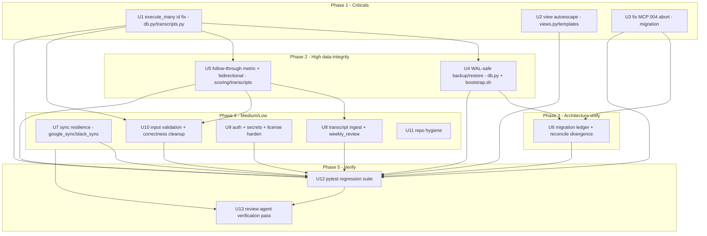

# fix: Remediate Engineering Review Findings

## Summary

Fix every finding from the 2026-06-23 engineering review — three criticals (wrong row-id on create, stored XSS in generated HTML views, the MCP migration abort that silently breaks email search), two highs (WAL-unsafe auto-restore, a structurally un-computable relationship metric), five mediums, and a cleanup tail — then **unify the dual-mode architecture** behind a real migration ledger, add a **minimal pytest regression suite**, and close with an **adversarial review-agent verification pass**. Work is dependency-ordered (criticals first) and partitioned by file-ownership so independent units fan out to parallel subagents.

---

## Problem Frame

Software of You ships as two delivery modes over one shared SQLite DB at `~/.local/share/software-of-you/soy.db`: a Claude Code plugin (`shared/` bash + Claude-driven SQL) and a distributable Python MCP server (`mcp-server/`). A full review found the product vision and the *design* of the data-integrity layer strong, but the *implementation* carries defects that quietly undermine the core "never fabricate, trustworthy data" promise:

- The MCP server hands Claude the **wrong record id on every create**, so follow-up edits/gets can hit the wrong row.
- Generated HTML views render **remote-attacker-controlled data unescaped**, an exploitable stored-XSS hole.
- The MCP copy of one migration **aborts mid-file**, so the gmail module never registers and **email search silently returns nothing** in the primary Claude Desktop deployment.
- The **data-loss "safety net" is itself WAL-unsafe** and can corrupt or re-lose data when it fires.
- A relationship metric divides by a status the system **never writes**, silently skewing relationship depth/sentiment.
- The two modes **share one DB file while running diverging migration sets** with **no applied-state tracking** — correctness rests entirely on every statement being idempotent, and the migration abort is the first place that broke.
- There are **zero automated tests**, which is why two of the three criticals shipped invisibly.

This plan remediates all of it and removes the structural conditions that allowed it.

---

## Key Technical Decisions

- KTD-1 — **Unify the two modes behind a real migration ledger (chosen direction).** Keep the shared DB, but stop relying on blind glob-and-re-run. Add applied-state tracking (a `schema_migrations` ledger keyed by filename + checksum, advisory on top of still-idempotent statements), mirror the **superset** of migrations into both `data/migrations/` and `mcp-server/src/software_of_you/migrations/`, and resolve the `017/018` numbering collision by renumbering the later-added set rather than overwriting. Because the ledger is **new**, it must be **seeded** on first run against the large existing installed base (every install already ran 001–018 with no ledger) — otherwise the first ledgered startup treats all migrations as un-applied and re-runs the whole set, relying on the very idempotency that already broke once. See U6 for the seeding step, the checksum-change policy, and the view-shadowing ordering constraint.
- KTD-2 — **`execute_many` stops being the id source for creates.** Introduce a dedicated insert-with-log helper that inserts the entity, captures *its* rowid, then writes `activity_log` using that rowid as a bound parameter — returning the entity id. This removes the reliance on trailing `last_insert_rowid()` and the last-statement `lastrowid` foot-gun in one place. Edit/delete batches that don't read the return value keep using `execute_many`.
- KTD-3 — **Enable Jinja autoescaping globally; make `|safe` the single audited exception.** Flip `autoescape=False → select_autoescape`, then guarantee the one intentional-HTML channel (`module_view.html` `section.html`) is assembled only from already-escaped or trusted fragments.
- KTD-4 — **Fix the follow-through metric where it actually lives — the stored value + the scoring formula, not "the view."** `v_contact_health.follow_through` does not compute anything: it reads the latest *stored* `relationship_scores.commitment_follow_through` (`ORDER BY score_date DESC LIMIT 1`), a value Claude derives via the formula documented in `scoring-methodology.md` and `transcripts.py` writes. So the real fix targets are (a) the broken formula in the scoring skill — redefine against `status='open' AND deadline_date < date('now')`, computable from existing data, not an `overdue` status no code writes; (b) the write path that stores it; and (c) a **backfill** of existing `relationship_scores` rows (NULL them so they display "—" until re-derived — otherwise the installed base keeps surfacing the old skewed value forever via `LIMIT 1`). Do not invent an `overdue` status write to satisfy the old formula. (A real `overdue` lifecycle, if ever wanted, is a separate feature.)
- KTD-5 — **Make backups/restore crash-consistent.** Use SQLite's online backup API (or checkpoint-then-copy of `.db`+`-wal`+`-shm`), and never copy over an open connection. The plugin's bash path must checkpoint explicitly **because the MCP server sets `journal_mode=WAL` persistently on the shared file out-of-band** — a naive `cp` of `.db` alone captures a stale snapshot missing committed-but-uncheckpointed rows.
- KTD-6 — **Most Python fixes are MCP-only; the plugin reaches the same outcomes through guidance.** `execute_many`, the Jinja views, and `google_sync` are MCP-server code. The plugin generates HTML and SQL through Claude following `skills/` + `CLAUDE.md`, so its parity fixes are guidance/escaping-rule additions, not code. Migration-ledger and backup fixes apply to **both** `db.py` and `shared/bootstrap.sh`.
- KTD-7 — **Partition by file-ownership for safe parallelism.** Units that co-edit `db.py` (U1, U4, U6), `transcripts.py` (U1, U5, U8, U10), or the `014` view (U5, U10) are sequenced; everything else fans out. Use worktree isolation only where a subagent batch would otherwise collide (see Execution Strategy).

---

## Findings Addressed (Traceability)

| ID | Severity | Finding | Unit |
|----|----------|---------|------|
| C1 | Critical | `execute_many` returns wrong row-id on every create | U1 |
| C2 | Critical | Stored XSS — `autoescape=False` in generated views | U2 |
| C3 | Critical | MCP migration 004 aborts → gmail unregistered → email search empty | U3 |
| H1 | High | WAL-unsafe backup/auto-restore can corrupt/re-lose data | U4 |
| H2 | High | `commitment_follow_through` un-computable; skews depth/sentiment | U5 |
| M1 | Medium | Reflected XSS in the 3rd OAuth callback (MCP `google_auth`) | U9 |
| M2 | Medium | Token expiry mid-sync drops data, reports success, advances timestamp | U7 |
| M3 | Medium | Bidirectional follow-through printed but only one value stored | U5 |
| M4 | Medium | `_add_analysis` drops a whole category on one bad item, reports success | U8 |
| M5 | Medium | `weekly_review` "commitments made" undercounts (filtered view) | U8 |
| L1 | Low | OAuth tokens / license / backups written without `0600` perms | U9 |
| L2 | Low | License bypassable (`TEST*` keys, unconditional 3-day grace) — **harden** | U9 |
| L3 | Low | Migration runner prints-and-continues / narrow exception handling | U6 |
| L4 | Low | No validation on enum-style tool args | U10 |
| L5 | Low | `CAST(julianday(...) AS INTEGER)` truncates day-counts | U10 |
| L6 | Low | Fuzzy single-match resolver silently drops/mis-attributes | U10 |
| L7 | Low | Duplicated occurred-at insert branching / resolvers | U1, U10 |
| A1 | Arch | Dual-mode shared DB, diverging migrations, no applied-state tracking | U6 |
| A2 | Arch | Zero automated tests | U12 |
| HY1 | Hygiene | `output` symlink committed to git, points at `/root/...` | U11 |
| HY2 | Hygiene | AGENTS.md "guidance to WARP" boilerplate + stale "no tests" note | U11 |

---

## High-Level Technical Design

Unit dependency and parallelization graph. Same-file-ownership units are sequenced; disjoint units run concurrently. U12 depends on every behavior-bearing unit it tests (U1–U10); U11 is hygiene with no test.

---

## Implementation Units

### U1. Fix `execute_many` row-id contract (C1)

- **Goal:** Every create returns the *entity's* id, not the trailing `activity_log` id.
- **Findings:** C1; absorbs the `transcripts.py` occurred-at branch portion of L7 (see Approach) to avoid a U1↔U10 collision on the same lines.
- **Dependencies:** none. (Touches `transcripts.py:78-102`, which U5/U8/U10 also touch — owns the occurred-at insert rewrite there.)
- **Files:** `mcp-server/src/software_of_you/db.py`; create sites that consume the return — `tools/contacts.py:72`, `tools/transcripts.py:80,92`, `tools/decisions.py:53`, `tools/notes_tool.py:52`, `tools/journal_tool.py:103`, `tools/interactions.py:163`, `tools/projects.py:75,219,273`; tests in `mcp-server/tests/test_db.py` (created in U12).
- **Approach:** Add `insert_with_log(entity_sql, entity_params, *, entity_type, action, details) -> int` to `db.py`: one connection, insert the entity, read `cursor.lastrowid`, insert the `activity_log` row with that id passed as a **bound parameter** (drop the inline `last_insert_rowid()` reliance), commit, return the entity rowid. Migrate the ~10 id-consuming create sites. The two `transcripts.py` create branches (occurred_at present vs absent, lines 80 and 92) are rewritten here using `COALESCE(?, datetime('now'))` so they collapse to one path through the new helper — this lands L7's transcript cleanup inside U1 rather than leaving the same lines for U10 to re-edit in a later wave. Leave edit/delete `execute_many` calls (which ignore the return) untouched. Directional only.
- **Patterns to follow:** the transaction/rollback shape already in `execute_many` (`db.py:155-172`).
- **Test scenarios:**
  - Happy path: with a pre-populated `activity_log` (so rowids diverge), adding a contact returns the contact's real id, and the `activity_log` row's `entity_id` equals that same id. (Exact review reproduction: real id `1` previously returned `6`.)
  - Edge: first-ever insert into an empty DB still returns id `1` and links correctly.
  - Integration: create → immediately `get(returned_id)` resolves the just-created entity for contacts, projects, tasks, milestones, decisions, notes, journal entries, transcripts, follow-ups.
  - Edge: a failing entity insert rolls back and writes no `activity_log` row.
  - Edge: transcript import with and without `occurred_at` both link `activity_log.entity_id` to the transcript id through the single collapsed path.
- **Verification:** the `test_db.py` tests (U12) fail against current `main` and pass after the change; every id-consuming create site round-trips create→get. (Because the suite is built in U12, this unit's tests are authored here and run green once U12 wires pytest.)

### U2. Enable view autoescaping + audit `|safe` (C2)

- **Goal:** Generated HTML can no longer execute script injected via DB/external data.
- **Findings:** C2 (MCP); plugin escaping-guidance parity.
- **Dependencies:** none.
- **Files:** `mcp-server/src/software_of_you/tools/views.py:28-31`; `templates/pages/module_view.html:98`; spot-check `templates/pages/entity_page.html`, `dashboard.html`; plugin parity in `skills/dashboard-generation/SKILL.md` and the "Generating HTML Views" section of `CLAUDE.md`.
- **Approach:** Replace `autoescape=False` with `jinja2.select_autoescape(["html"])`. Trace what feeds `module_view.html`'s `{{ section.html | safe }}` (the `narrative_sections` / `discovery_questions` builders in `views.py`) and ensure any DB- or external-derived substring inside those fragments is escaped before the fragment is marked safe — `|safe` must wrap only trusted, pre-escaped HTML. For the plugin, add an explicit rule to the dashboard skill + CLAUDE.md: HTML-escape all DB/email/calendar/transcript values when emitting generated HTML.
- **Patterns to follow:** standard Jinja `select_autoescape`; keep markup identical otherwise.
- **Test scenarios:**
  - Happy path: a contact named `` renders as inert escaped text in the entity page, not an executing tag.
  - Stored-XSS class (the same class M1 covers reflectively in U9): an email `from_name` / calendar `event.title` containing `">` renders inert in dashboard + entity page.
  - Edge: the intentional `section.html` channel still renders legitimate chart/markup HTML correctly (no double-escaping of trusted fragments).
  - Negative: grep test asserting no template path reintroduces `autoescape=False`.
- **Verification:** rendered output for malicious inputs contains no live `<script>`/event-handler tags; legitimate generated pages still render.

### U3. Restore gmail registration — fix MCP migration 004 abort (C3)

- **Goal:** A fresh MCP-standalone DB registers the gmail module and email search works.
- **Findings:** C3. (U6 later folds 004 into the mirrored superset; U3 is the urgent critical slice.)
- **Dependencies:** none.
- **Files:** `mcp-server/src/software_of_you/migrations/004_gmail_module.sql`; verify against `data/migrations/004_gmail_module.sql`.
- **Approach:** The MCP copy declares `from_name` in `CREATE TABLE` *and* re-adds it via `ALTER TABLE` (line ~24), so the ALTER throws `duplicate column` on a fresh DB and aborts the rest of the script (indexes + `INSERT ... modules ('gmail')` never run). Remove the redundant standalone ALTER in the MCP copy, and make the two 004 files byte-identical so both modes converge on the same `emails` **column set**. Note: column *order* will not converge for the existing installed base — plugin DBs added `from_name` via a trailing ALTER (it sits last), while a fresh MCP `CREATE TABLE` places it mid-table; `CREATE TABLE IF NOT EXISTS` is a no-op on an existing table. All access is by column name (the `emails` INSERT uses named columns; reads use `SELECT *` → dict), so this is benign — but the convergence assertion must test the column *set*, not order (see Test scenarios).
- **Patterns to follow:** the plugin's 004 ordering (module registration before the trailing ALTER) is the safe reference.
- **Test scenarios:**
  - Happy path: run all MCP migrations on a fresh DB; assert `SELECT 1 FROM modules WHERE name='gmail'` returns a row and `idx_emails_*` indexes exist.
  - Covers C3 functional break: with gmail registered, the email-search tool returns matching rows instead of empty.
  - Edge: re-run migrations on the same DB — no error, gmail still registered (idempotent).
  - Cross-mode: a DB initialized by the plugin then opened by MCP (and vice versa) ends with the same `emails` **column set** (compare sorted column names, not ordinal positions) and one `gmail` module row.
- **Verification:** fresh-DB MCP init registers gmail; email search non-empty; both 004 files identical; column-set convergence test passes on a plugin-seeded DB.

### U4. WAL-safe backup and auto-restore (H1)

- **Goal:** Backups are crash-consistent and the restore path cannot corrupt or re-lose data.
- **Findings:** H1.
- **Dependencies:** U1 (shared `db.py` edits; sequence to avoid collision).
- **Files:** `mcp-server/src/software_of_you/db.py:46-61` (`backup_db`), `:104-124` (restore branch, `_restore_latest_backup`); `shared/bootstrap.sh:73-109` (bash backup + restore).
- **Approach:** Use SQLite's online backup API (`sqlite3.Connection.backup`) for `backup_db`, or `PRAGMA wal_checkpoint(TRUNCATE)` then copy `.db`+`-wal`+`-shm` together. **Resolve the connection-ownership problem:** `run_migrations` accepts an externally-owned `conn` (`close_after=False`, the `init_db` path), and the current restore branch only closes when `close_after` is True — so it can `shutil.copy2` over a backup while the caller still holds an open handle to the now-overwritten file, corrupting exactly as the review warns. Change the contract so the restore path checkpoints/closes the live connection before copy and reopens, regardless of who opened it (e.g., have `init_db` own the close/reopen, or pass a flag so restore can do it safely). In `bootstrap.sh`, run `PRAGMA wal_checkpoint(TRUNCATE)` (or copy `.db`+`-wal`+`-shm`) **before** the `cp` at `:77` and the restore copy at `:101` — the bash path has no WAL connection of its own, but the shared file is in WAL mode because MCP set it persistently, so a raw `cp` of `.db` alone silently drops uncheckpointed rows.
- **Patterns to follow:** Python `sqlite3` backup API; existing rolling-5 retention logic stays.
- **Test scenarios:**
  - Happy path: write rows, `backup_db()`, mutate, restore — restored DB exactly equals the backed-up state (row counts + checksums).
  - Edge: backup taken with an uncheckpointed `-wal` present still produces a complete, openable DB (no lost committed rows).
  - Cross-mode: MCP writes rows in WAL mode → bash bootstrap backup → the backup contains those rows (the checkpoint-before-cp case).
  - Failure path: simulate the data-loss trigger (contacts present → migration empties them) and assert restore returns the original contacts without corruption, with the connection lifecycle handled safely (no copy over an open caller-owned conn).
  - Regression: restore leaves no stale `-wal`/`-shm` that re-clobbers the restored file on next open.
- **Verification:** restored DB integrity-checks clean (`PRAGMA integrity_check`) and matches pre-loss state across both modes.

### U5. Fix follow-through metric + bidirectional storage (H2, M3)

- **Goal:** Relationship follow-through is a real, computable percentage in both directions, stored fresh and not silently skewing depth/sentiment — and existing skewed rows stop being surfaced as fact.
- **Findings:** H2, M3.
- **Dependencies:** U1 (shared `transcripts.py`; sequence after).
- **Files:** `skills/conversation-intelligence/references/scoring-methodology.md` (the broken formula — primary fix target); `mcp-server/src/software_of_you/tools/transcripts.py:221-235` (the write path); a new migration (mirrored to both dirs) to add a second-direction column to `relationship_scores` **and** backfill existing rows; `data/migrations/014_computed_views.sql` + the MCP mirror only if the view's read needs adjusting for the second direction.
- **Approach:** The metric is a **stored** value, not a view computation — `v_contact_health.follow_through` reads `relationship_scores.commitment_follow_through` via `ORDER BY score_date DESC LIMIT 1`. So: (1) **Fix the formula in `scoring-methodology.md`** to derive from existing data — completed vs. genuinely-late open commitments (`status='open' AND deadline_date < date('now')`; `overview.py:103` already uses this exact predicate) — instead of dividing by an `overdue` status no code writes. (2) **Store both directions.** Prefer adding a **second column** (e.g., `follow_through_inbound`) over a `direction` discriminator row, because the view's `LIMIT 1` read returns a single row — a discriminator would surface only one direction and force additional view surgery the unit doesn't otherwise need. (3) **Backfill:** the new migration must NULL the legacy `commitment_follow_through` on existing `relationship_scores` rows (display "—" until re-derived) so the installed base stops showing the old skewed value forever. (4) Confirm depth/sentiment gates treat NULL as "insufficient data," not a failing 0, before claiming the skew is removed. Keep `NULL` whenever data is genuinely absent (never fabricate).
- **Patterns to follow:** `overview.py:103` predicate; existing `NULLIF(...,0)` guards in `014`; the single-row `LIMIT 1` read contract in `v_contact_health`.
- **Test scenarios:**
  - Happy path: a contact with 3 completed and 1 past-deadline open commitment yields follow-through `0.75` after re-analysis, not `1.0`/`NULL`.
  - Backfill: a pre-existing `relationship_scores` row with a legacy value reads `NULL` ("—") after the migration, not the stale number.
  - Edge: zero commitments → `NULL`, and depth/sentiment gates treat `NULL` as "insufficient data," not a failing 0.
  - Edge: both directions stored independently; a one-sided relationship shows one value and `NULL` for the other, not the same number echoed by `LIMIT 1`.
  - Regression: the documented formula in `scoring-methodology.md` matches what the write path stores (no drift).
- **Verification:** follow-through spans the real 0–1 range on seeded+re-analyzed data; existing rows show "—" until re-derived; depth/sentiment no longer flip on a single completed commitment.

### U6. Migration applied-state ledger + reconcile divergence (A1, C3-completion, L3)

- **Goal:** One coherent migration system across both modes — tracked, seeded for existing installs, mirrored, collision-free, and loud on real failure.
- **Findings:** A1, L3; completes C3's mirroring.
- **Dependencies:** U3 (004 mirrored), U4 (db.py settled).
- **Files:** `mcp-server/src/software_of_you/db.py:73-115` (runner); `shared/bootstrap.sh:83-109` (runner); both migration directories; `AGENTS.md` (migration-authoring note).
- **Approach:** Add a `schema_migrations(filename TEXT PRIMARY KEY, checksum TEXT, applied_at TEXT)` ledger. The runner records each applied file + checksum and skips unchanged already-applied files; statements stay idempotent as belt-and-suspenders.
  - **Seed existing installs:** on first run where `schema_migrations` is empty but the DB is non-empty (e.g., `modules`/`contacts` present), pre-populate the ledger as "already applied" for the pre-ledger migration set **before** the runner loop, so existing installs don't blindly re-run everything on the WAL-mode shared file.
  - **Checksum-change policy:** edited-in-place idempotent migrations (this plan itself rewrites 004 in U3 and may touch 014 in U5, same filename, new checksum) should re-run safely and update the ledger — document that authors must keep edited migrations idempotent; never add a non-idempotent statement (e.g., a bare `INSERT`) to an existing migration file.
  - **Reconcile divergence:** resolve the `017/018` collision by renumbering the later-added set (MCP `017_slack`/`018_slack_views` → `019`/`020`) and mirror the **superset** into both dirs so plugin and MCP carry identical migration trees. **Ordering constraint:** `slack_views` (`DROP/CREATE v_contact_health`, `v_nudge_items` referencing `slack_messages`) must run *after* both `slack_module` (creates `slack_messages`) and the plugin's `014`/`016` view definitions, so the slack-aware definition wins and references an existing table. Renumber to preserve that order.
  - **Loud on real failure:** distinguish expected idempotency errors (`duplicate column`/`already exists` → skip quietly) from genuine failures, and broaden beyond the current `OperationalError`-only catch (an `IntegrityError` today propagates uncaught and aborts startup) — record failures in the ledger/log and surface them, never silently continue. In `bootstrap.sh`, replace the blanket `2>/dev/null` with per-file exit-code inspection + an allow-list of expected error strings.
  - Update AGENTS.md's "keep these in sync" note to reference the ledger + superset + ordering rules.
- **Patterns to follow:** existing `DROP VIEW IF EXISTS` + `CREATE ... IF NOT EXISTS` idempotency in `014`/`016`/`018`.
- **Test scenarios:**
  - Existing-install seeding: a pre-ledger DB with data → ledger seeded as applied, runner re-runs nothing, no spurious warnings.
  - Fresh DB → all superset migrations apply once; `schema_migrations` lists each filename with a checksum.
  - Idempotency: second run applies nothing new and errors nowhere.
  - Edited-in-place: a migration whose content changed (new checksum, same filename) re-runs exactly once, idempotently, and updates the ledger.
  - Renumber safety: a DB previously migrated under the old `017_slack` name re-applies the renamed `019_slack` exactly once with no data change.
  - View-shadowing order: after the full superset, `v_contact_health` resolves (no "no such table: slack_messages") in both modes.
  - Cross-mode: plugin-init then MCP-init (and reverse) converge to the same table set and `modules` rows.
  - Failure path: a deliberately broken migration (syntax error AND a constraint violation) is recorded as failed and surfaced (visible), not swallowed.
  - Drift guard: a test asserts the two migration directories are byte-identical.
- **Verification:** both modes produce the same schema; ledger seeded and populated; broken migrations are loud; existing installs don't re-run the full set.

### U7. Sync resilience — token refresh + honest partial-failure (M2)

- **Goal:** A mid-sync token expiry refreshes and retries; partial failures don't masquerade as success or suppress the next sync.
- **Findings:** M2.
- **Dependencies:** none.
- **Files:** `mcp-server/src/software_of_you/google_sync.py:95-98` (and sync entry points); `slack_sync.py` (same pattern).
- **Approach:** On a per-item `401`, refresh the OAuth token once and retry; return a shape distinguishing partial failure (`{synced, failed}`), and **do not advance** `gmail_last_synced` / `calendar_last_synced` / Slack timestamps when items were dropped, so auto-sync retries instead of waiting out the 15-minute window. Keep existing 15s timeouts; add minimal backoff on transient errors.
- **Patterns to follow:** existing token-refresh path in `google_auth.py`; existing timeout usage.
- **Test scenarios:**
  - Happy path: all items fetched → timestamp advances; `failed == 0`.
  - Failure path: token expires after N items → refresh+retry recovers remaining; if some still fail, return `failed > 0` and leave the timestamp unchanged.
  - Edge: hard network outage → no timestamp advance, no false success, cached data still usable.
  - Regression: a single bad message no longer silently zero-counts the rest while reporting success.
- **Verification:** induced mid-sync 401 recovers; partial failure leaves the sync due, not marked fresh.

### U8. Transcript ingest robustness + weekly_review accuracy (M4, M5)

- **Goal:** Malformed transcript items don't silently drop a whole category, and "commitments made this week" counts correctly.
- **Findings:** M4, M5.
- **Dependencies:** U5 (shared `transcripts.py` / `014`; sequence after).
- **Files:** `mcp-server/src/software_of_you/tools/transcripts.py:159-237`; `tools/intelligence.py:377-381`; `014_computed_views.sql` (+ mirror) for the `v_commitment_status` filter interaction.
- **Approach:** Move the `except (json.JSONDecodeError, KeyError): pass` from around each whole section-loop to per-item, skipping only the bad item and accumulating a `skipped` count returned to the caller. For `weekly_review`, count "commitments made this week" from the base `commitments` table (created-this-week), not from the open/overdue-filtered `v_commitment_status`, so same-week made-and-completed commitments are included.
- **Patterns to follow:** the existing per-section structure in `_add_analysis`; the base-table query already used for "completed" at `intelligence.py:383`.
- **Test scenarios:**
  - Happy path: a transcript with 4 valid commitments + 1 malformed stores 4 and returns `skipped=1`.
  - Edge: every item malformed → stores 0, `skipped=N`, caller sees the gap.
  - M5 happy path: a commitment created and completed in the same week is counted in both "made" and "completed."
  - Regression: "made this week" ≥ "completed this week" for same-week activity.
- **Verification:** partial ingest reports skips; weekly counts reconcile against raw rows.

### U9. Auth callback escaping, secrets-at-rest, license hardening (M1, L1, L2)

- **Goal:** Close the third OAuth XSS, store all secret-bearing files `0600`, and make the license non-trivial to bypass.
- **Findings:** M1, L1, L2.
- **Dependencies:** none (owns all auth/license files to avoid collision with U2).
- **Files:** `mcp-server/src/software_of_you/google_auth.py:326` (escape) + `save_token` (chmod); `shared/google_auth.py` (chmod parity); `slack_auth.py:57` (chmod); `license.py:53-55,81,99,121-130`; the backup writers in `db.py`/`bootstrap.sh` (backup `.db` perms).
- **Approach:** (M1) `html.escape` the `error` query param in the MCP `google_auth` callback, mirroring `slack_auth.py:104` and `shared/google_auth.py:466`. (L1) `os.chmod(path, 0o600)` after writing token and license files in all three modules — **and** apply `0600` to the rolling backup `.db` files, which contain the same data the DB does. (L2 — harden per decision) gate the `TEST*`-key bypass behind an explicit opt-in (env var / build flag) rather than any key prefix, and tighten `_store_pending` so the 3-day offline grace requires a prior successful activation, is anchored to that activation, and cannot be re-granted indefinitely. Directional — exact gating mechanism finalized in implementation; must not lock out legitimate users with a prior valid activation.
- **Patterns to follow:** `slack_auth.py:104` / `shared/google_auth.py:466` escape; standard `os.chmod`.
- **Test scenarios:**
  - M1: an `error` param of `</body><script>...` renders escaped/inert in the callback HTML.
  - L1: after activation/sync, `license.json`, token files, **and** backup `.db` files have mode `0600`.
  - L2 happy path: a real (mock) key validates; a `TEST*` key validates **only** when the explicit test-mode flag is set, and is rejected otherwise.
  - L2 grace: network error with a prior valid activation grants grace once, anchored to that activation; network error with no prior activation does **not** grant access; grace cannot extend indefinitely.
  - Regression: no secret value is printed/logged (assert on captured stderr/stdout).
- **Verification:** callback escapes hostile input; secret + backup files are `0600`; `TEST` keys no longer auto-pass without opt-in.

### U10. Input validation + correctness cleanup (L4, L5, L6, L7)

- **Goal:** Reject junk enum args, stop rounding day-counts down, and de-risk fuzzy resolution + the remaining duplicated resolvers.
- **Findings:** L4, L5, L6, L7 (the `transcripts.py` occurred-at portion of L7 is handled in U1; U10 covers the `interactions.py` resolver duplication and the fuzzy-match helper).
- **Dependencies:** U1 (transcript occurred-at already collapsed there), U5 (shared `014` view; sequence after).
- **Files:** `tools/contacts.py`, `tools/projects.py:249`, `tools/interactions.py`, `tools/transcripts.py`; `014_computed_views.sql` (+ mirror); `slack_sync.py:66-73` and the repeated resolver in `projects.py:63-65` / `interactions.py`.
- **Approach:** (L4) Validate enum-style args (`status`, `priority`, `contact_type`, `direction`, `interaction_type`, `task_status`) against allowed sets at the tool boundary, returning a clear error on mismatch. (L5) Round rather than truncate day-counts (`CAST(julianday(...) - julianday(...) + 0.5 AS INTEGER)` or `ROUND`) across `v_*` day columns. (L6) Extract one shared `resolve_contact` helper; on ambiguous multi-match, surface the ambiguity (or prefer a stable key like Slack `user_id`) instead of silently returning `None`. (L7) Collapse remaining duplicated insert branching not already handled in U1.
- **Patterns to follow:** the `emails.direction` DB `CHECK` constraint; the `task_status='done'` special-case at `projects.py:249`.
- **Test scenarios:**
  - L4: `task_status="complete"` (typo) is rejected with a clear error; `"done"` stamps `completed_at`.
  - L5: a deadline 1.9 days past reports "2 days overdue," not "1."
  - L6: two contacts named "Chris" → resolver reports ambiguity rather than dropping the link; exact/unique match still resolves.
  - L7: occurred-at omitted → DB default fills `datetime('now')`; provided → stored verbatim, via one code path.
- **Verification:** invalid enums error out; day-counts match rounded expectations; resolver no longer silently drops.

### U11. Repo hygiene (HY1, HY2)

- **Goal:** Stop shipping a broken committed symlink and stale docs.
- **Findings:** HY1, HY2. (Plugin escaping-guidance parity is owned by U2, not here.)
- **Dependencies:** none.
- **Files:** `.gitignore`, the tracked `output` symlink, `AGENTS.md:3,56`.
- **Approach:** `git rm --cached output` and add `/output` to `.gitignore` (bootstrap recreates it per-environment; it should never be tracked, like `data/soy.db`). Replace AGENTS.md's "provides guidance to WARP (warp.dev)" opener with an accurate description of this repo, and update the "There are no automated tests" line once U12 lands.
- **Test scenarios:** Test expectation: none — repo-config and docs changes. Verification is a clean `git status` and `git ls-files | grep -c '^output$' == 0`.
- **Verification:** `output` is no longer tracked; a fresh clone has no broken symlink before bootstrap; AGENTS.md reflects reality.

### U12. Minimal pytest regression suite (A2)

- **Goal:** A permanent safety net covering the exact regressions that shipped, so they can't silently return.
- **Findings:** A2; locks U1–U10.
- **Dependencies:** U1–U10 landed (tests assert their fixed behavior). U11 is hygiene — not tested here.
- **Files:** `mcp-server/pyproject.toml` (`[project.optional-dependencies] dev` += `pytest`); `mcp-server/tests/conftest.py`; `tests/test_db.py` (U1), `test_migrations.py` (U3/U6), `test_views_escaping.py` (U2), `test_backup_restore.py` (U4), `test_metrics.py` (U5), `test_sync_resilience.py` (U7), `test_transcript_robustness.py` (U8), `test_license.py` (U9), `test_input_validation.py` (U10); `AGENTS.md` dev-commands section.
- **Approach:** Add `pytest` as a dev dependency. `conftest.py` provides an isolated DB fixture (point `XDG_DATA_HOME` at `tmp_path`, or monkeypatch `db.DB_PATH`) so tests never touch the user's real DB. Cover every behavior-bearing unit: `insert_with_log` id contract (U1), migration runner on fresh/existing/cross-mode DBs + seeding + ledger (U3/U6), view autoescaping of hostile input (U2), WAL-safe backup/restore integrity (U4), follow-through computation + backfill (U5), sync partial-failure semantics (U7), transcript per-item robustness + weekly counts (U8), license gating (U9), enum/day-count/resolver behavior (U10). The per-unit test scenarios authored alongside U1–U10 are realized and wired here. Document `pytest` in AGENTS.md.
- **Patterns to follow:** standard pytest fixtures; `hatch`/`pyproject` dev-extras already scaffolded.
- **Test scenarios:** this unit *is* the suite; scenarios are enumerated per U1–U10. Test expectation: the suite reproduces each critical/high against pre-fix behavior and passes post-fix.
- **Verification:** `pytest` green; intentionally reverting any one fix turns its test red.

### U13. Review-agent verification pass

- **Goal:** Independently re-check the full diff before declaring done — the explicit "spin up review agents at the end" request.
- **Findings:** verification gate for all.
- **Dependencies:** U1–U12.
- **Files:** none (verification only); produces a findings summary.
- **Approach:** Fan out parallel review subagents over the final diff, one per dimension mirroring the original review: (1) **correctness** — re-verify C1/C3/H1/M2/M4/M5 and scan for new bugs; (2) **security** — re-verify C2/M1/L1/L2, confirm the XSS class is closed (no remaining `autoescape=False`, `|safe` audited, backup perms `0600`); (3) **data integrity** — re-verify H2/M3 honor "never fabricate" including the backfill, and the migration/ledger unification + seeding (A1/L3). Run the `pytest` suite and a fresh-DB + existing-DB (pre-ledger, seeded) + cross-mode migration smoke test. Each agent returns severity-ranked findings; any Critical/High reopens the relevant unit.
- **Test scenarios:** Test expectation: none — meta-verification. Gate: zero unresolved Critical/High findings AND green suite.
- **Verification:** all three review agents report clean (or only accepted Low/nit findings); `pytest` and migration smoke tests pass on fresh, existing-seeded, and cross-mode DBs.

---

## Execution Strategy (Subagent Fan-Out)

`ce-work` should dispatch by wave, respecting file-ownership to avoid collisions. Units sharing a file are sequenced; the rest run as parallel subagents.

| Wave | Parallel subagents | Shared-file sequencing |
|------|--------------------|------------------------|
| 1 | U1, U2, U3, U7, U9, U11 | all touch disjoint files → safe parallel |
| 2 | U4, U5 | U4 after U1 (`db.py`); U5 after U1 (`transcripts.py`) |
| 3 | U6, U8, U10 | U6 after U3+U4 (`db.py`/migrations); U8 & U10 after U5 (`transcripts.py`/`014`) |
| 4 | U12 | after U1–U10 land |
| 5 | U13 (3 review agents in parallel) | after U12 |

- `transcripts.py` is co-edited by U1, U5, U8, U10 — U1 owns the occurred-at/insert rewrite (absorbing L7's transcript portion); U5/U8/U10 sequence after to avoid clobbering the collapsed insert path.
- Use **worktree isolation** for a wave's subagents only if `ce-work` runs them truly concurrently against the same tree; otherwise sequential-within-tree is fine since ownership is disjoint.
- Keep the two migration directories byte-identical after any migration-touching unit (U3, U5, U6, U8, U10) — the drift-guard test in U12 enforces this; mirror every shared-SQL edit into both dirs in the same commit.

---

## Scope Boundaries

**In scope:** every finding in the traceability table; dual-mode unification behind a migration ledger; a minimal pytest suite; an adversarial review-agent verification pass.

### Deferred to Follow-Up Work
- A full migration framework (Alembic-style) — the lightweight ledger is sufficient; revisit only if migration complexity grows.
- A real `overdue` commitment lifecycle (background job/trigger flipping `open → overdue`) — only if surfacing "overdue" as a first-class status becomes a product feature; the metric fix (U5) does not need it.
- Normalizing `emails` column *order* across the installed base — benign under name-based access; not worth a data migration.
- Broad test coverage beyond the critical/high regression paths — U12 is a targeted net, not full coverage.

### Outside this product's identity
- New product features (Windows support, additional modules) — unrelated to remediation.
- Re-architecting away from the shared-DB model — the user chose unification, not separation.

---

## Risks & Dependencies

- **Ledger introduced on a live installed base (U6).** Without the seeding step, the first ledgered run re-runs every migration on existing DBs (relying on the idempotency that already broke once) and records fictional `applied_at`. Mitigated by the seeding step + the existing-install test. Take a backup before the first ledgered run.
- **Migration renumbering + view shadowing (U6).** Renaming MCP `017/018` and mirroring the superset must preserve order so `slack_views` runs after `slack_module` and the base view definitions; wrong order yields a view referencing a missing table that the runner warns-and-continues past. Mitigated by the view-shadowing-order test.
- **Metric fix is multi-surface (U5).** The fix lives in the scoring skill + write path + a backfill migration, not the view; missing the backfill leaves the installed base skewed. The backfill test covers this.
- **Cross-mode column order does not converge (U3/U6).** Existing plugin DBs keep `from_name` last; the convergence test asserts column *set*, not order. Benign because access is name-based.
- **Shared `db.py` / `transcripts.py` contention.** Strict sequencing required (U1→U4→U6 on `db.py`; U1→U5→U8/U10 on `transcripts.py`); do not parallelize these.
- **Autoescape double-escaping (U2).** Flipping autoescape can double-escape the legitimate `|safe` chart channel; U2 tests cover trusted-fragment rendering. Residual: a script that still reaches the `|safe` channel could exfiltrate from a browser-opened file — the `|safe`-input audit is the control.
- **License hardening UX (U9).** Tightening `TEST` keys/grace must not lock out legitimate beta users — gate behind an explicit, documented opt-in anchored to a prior valid activation.
- **Plugin parity is guidance, not code (U2 plugin half, KTD-6).** The plugin's XSS posture depends on Claude following the new escaping rule; lower assurance than the MCP code fix — call it out prominently in the skill, and have U13 spot-check one generated plugin HTML sample.

---

## Review Coverage Note

This plan was strengthened by a document-review pass (coherence, feasibility, adversarial reviewers, codebase-verified). The security-lens and scope-guardian reviewers could not complete due to transient API overload; the one clear security addition they would likely surface (backup files carrying the same secrets → `0600`) was folded into U9 manually. A re-run of those two lenses is advisable if a deeper plan-review pass is wanted before execution.
